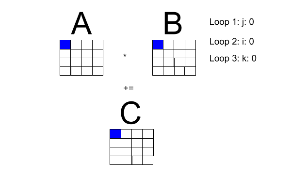

+++
title = "Concurrent Rust: matrix multiplication."
description = "Writing several concurrent matrix multiplication routines."
author = "Boyd Johnson"
date = 2020-03-30
+++

Let's write some concurrent programs with [A Safe, Concurrent, Practical Language](https://web.archive.org/web/20180713235500/https://github.com/rust-lang/rust/), Rust!. Taking examples from the first chapter of [Foundations of Multithreaded, Parallel, and Distributed Programming](https://www.amazon.com/Foundations-Multithreaded-Parallel-Distributed-Programming/dp/0201357526), we will explain several concurrent Rust programs to solve
matrix multiplication.

My impetus for doing this project is that I find thinking carefully about concurrent programs fun and with the COVID-19 pandemic I've had more time.
Check out [the github repo](https://github.com/boydjohnson/examples-multithreading-distributed-programming) for the programs mentioned in this blog post and possibly future ones.

## Requirements
Let's start with some requirements: we will stick to the standard library as much as possible, but if a library has some signification traction and staying power, we may choose to use that library. To promote code-reuse, all of our matrix multiplication routines will conform to the same api:

```rust
    Fn(&[Vec<f64>], &[Vec<f64>]) -> Vec<Vec<f64>>
```

Note: Fn is a trait that is implemented for both functions and closures. [Rust docs on Fn](https://doc.rust-lang.org/std/ops/trait.Fn.html).

We will be making command line executables so that we can easily test with the `time` bash function. We could write more formal benchmarks but coarse timings are good enough for this exercise.

## Background

Now, the problem space: matrix multiplication. I made the following diagram to get a better handle on what is going on with matrix multiplication. Note: Loop 1 and Loop 2 can be transposed.

<figure class="image">



</figure>

## Sequential program

One of the book's pseudocode examples has a sequential program for square matrix multiplication, reproduced here with
the i-loop transposed with the j-loop to fit our diagram.

**Square matrix multiplication pseudocode**
```bash
for [j = 0 to n-1] {
    for [i = 0 to n-1] (
        # compute inner product of a [i, *] and b [* , j]
        c[i, j] = 0.0;
        for [k = 0 to n-1]
            c[i, j] = c[i, j] + a[i, k] * b[k , j]
    }
}
```

A faithful translation of these nested loops into Rust looks like this.
```rust
/// Sequentially multiply A and B square matrices.
pub fn simple_multiply_a_b(a: &[Vec<f64>], b: &[Vec<f64>]) -> Vec<Vec<f64>> {
    if b.len() == 0 {
        return vec![];
    } else {
        if b[0].len() == 0 {
            return vec![];
        }
    }

    if a.len() == 0 {
        return vec![];
    } else {
        if a[0].len() == 0 {
            return vec![];
        }
    }

    // Assert that a and b are square matrices of the same size.
    assert_eq!(a.len(), a[0].len());
    assert_eq!(a.len(), b.len());
    assert_eq!(b.len(), b[0].len());

    let n = b.len();

    let mut c = vec![vec![0.0_f64; n]; n];

    for j in 0..n {
        for i in 0..n {
            for k in 0..n {
                c[i][j] += a[i][k] * b[k][j];
            }
        }
    }
    c
}
```

The early returns at the beginning are dealing with the possibilitity that a and b have no elements. After compiling this function into
a command line program, we can test it on several sizes of square matrices. 

```bash
$ time ./target/release/sequential-mm -n 100

real	0m0.009s
user	0m0.004s
sys	0m0.006s
$ time ./target/release/sequential-mm -n 1000

real	0m3.602s
user	0m3.582s
sys	0m0.020s
$ time ./target/release/sequential-mm -n 1500

real	0m13.787s
user	0m13.766s
sys	0m0.020s
```

Let's pull out the loops section from the larger function but write it with iterator combinators. We will transpose the outer loops
so that the resulting Vec iterates over the rows of the matrix. This makes it so that we can compare results in tests without further
modification.

```rust
fn compute_matrix_combinators(n: usize, a: &[Vec<f64>], b: &[Vec<f64>]) -> Vec<Vec<f64>> {
    (0..n)
        .map(|i| {
            (0..n)
                .map(|j| (0..n).map(|k| a[i][k] * b[k][j]).sum())
                .collect::<Vec<f64>>()
        })
        .collect::<Vec<Vec<f64>>>()
}
```

A coding decision we can make to make it clearer that the k elements of the i-th row of a are being multiplied by the k elements of the j-th column
of b is create a variable binding that names the i-th row of a.

```rust
fn compute_matrix_combinators(n: usize, a: &[Vec<f64>], b: &[Vec<f64>]) -> Vec<Vec<f64>> {
    (0..n)
        .map(|i| {
            let a_row = &a[i];

            (0..n)
                .map(|j| (0..n).map(|k| a_row[k] * b[k][j]).sum())
                .collect::<Vec<f64>>()
        })
        .collect::<Vec<Vec<f64>>>()
}
```

We ultimately won't be able to do the same thing with the j-th column of b, because of the Vec of Vec datastructure we used.

The function `compute_matrix_combinators` can be broken up further so the j-loop is in a separate function.

```rust
fn compute_matrix_combinators_2(n: usize, a: &[Vec<f64>], b: &[Vec<f64>]) -> Vec<Vec<f64>> {
    (0..n)
        .map(|i| {
            let a_row = &a[i];
            compute_row_of_sums(a_row, b, n)
        })
        .collect::<Vec<Vec<f64>>>()
}

fn compute_row_of_sums(a_row: &[f64], b: &[Vec<f64>], n: usize) -> Vec<f64> {
    (0..n)
        .map(|j| (0..n).map(|k| a_row[k] * b[k][j]).sum())
        .collect::<Vec<f64>>()
}

```
## Parallel matrix multiplication

### Parallelize the i-loop
The *Foundations* pseudocode for parallelizing the outer loop looks like:

```bash
co [i = 0 to n-1] { # rows in parallel then
    for [j = 0 to n-1] {
        c[i, j] = 0.0;
        for [k = 0 to n-1] {
            c[i, j] = c[i, j] + a[i, k] * b[k , j];
        }
    }
}
```
which just means that each i-loop can happen in parallel without specifying how it should be done.

Since we have iterators, let's turn to [Rayon](https://docs.rs/rayon/1.3.0/rayon/) to make those iterators parallel.


The api of Rayon is not a drop-in replacement of `Iterator`, but is highly similar. There are methods `Map`, `Filter`, `Fold`, etc with slight modifications from `Iterator`, the most important of which is the methods take `Fn` closures instead of `FnMut` closures. We should keep in mind there will
be a second step in our `compute_matrix_combinators*` function: sorting the rows so that they are back in order. This is common in concurrent applications
where there needs to be special care or a new component that orders the items that were out of order due to the concurrency.

So compute the rows in any order, and then order the rows into ascending order:
```rust
fn compute_matrix_combinators_rayon(n: usize, a: &[Vec<f64>], b: &[Vec<f64>]) -> Vec<Vec<f64>> {
    let mut unordered_rows = (0..n)
        .into_par_iter()
        .map(move |i| {
            let a_row = &a[i];

            (i, compute_row_of_sums(a_row, b, n))
        })
        .collect::<Vec<(usize, Vec<f64>)>>();

    unordered_rows.par_sort_by(|left, right| left.0.cmp(&right.0));

    unordered_rows.into_iter().map(|(_, row)| row).collect()
}
```

Note the use of the Rayon method `par_sort_by` instead of `sort_by`.


Compiling that into a command-line program we get a speedup.

```bash
$ time ./target/release/sequential-mm -n 500

real	0m0.422s
user	0m0.414s
sys	0m0.009s
$ time ./target/release/rayon-parallel-mm -n 500

real	0m0.162s
user	0m0.578s
sys	0m0.008s
```

Notice that eventhough we get a speedup in real time, the user time is greater than the sequential case, so there is a tradeoff to be made
between use of resources and speed.


### Parallelize the j-loop

So we will do the same thing to `compute_row_of_sums` that we did with `compute_matrix_combinators`:

```rust
fn compute_row_of_sums_rayon(a_row: &[f64], b: &[Vec<f64>], n: usize) -> Vec<f64> {
    let mut unordered_columns = (0..n)
        .into_par_iter()
        .map(|j| (j, (0..n).map(|k| a_row[k] * b[k][j]).sum()))
        .collect::<Vec<(usize, f64)>>();

    unordered_columns.par_sort_by(|left, right| left.0.cmp(&right.0));

    unordered_columns
        .into_iter()
        .map(|(_, col_el)| col_el)
        .collect()
}
```

Composing this into a `compute_matrix_*` function and compiling it into a command-line executable we don't get a speedup,
and perhaps get somewhat of a slowdown.

```bash
$ time ./target/release/rayon-parallel-mm -n 500

real	0m0.162s
user	0m0.578s
sys	0m0.008s
$ time ./target/release/rayon-par-par-mm -n 500

real	0m0.177s
user	0m0.653s
sys	0m0.009s
$ time ./target/release/rayon-parallel-mm -n 1000

real	0m2.867s
user	0m11.301s
sys	0m0.056s
$ time ./target/release/rayon-par-par-mm -n 1000

real	0m2.999s
user	0m11.841s
sys	0m0.026s
```

## Thoughts on the whole exercise

Rayon made this *significantly* easier than creating our own threadpool (Task for another day ...) or using probably any other threadpool
implementation. I'm sure a person could create faster code with SIMD or a gpu library, but wouldn't have fit my purposes. My thoughts on the lack of
a speed up when parallelizing the j-loop is that the cost of sorting at the end of each inner loop (the costs of parallelization), outwieghs the parallelism that we get. If you notice something out of sorts create an issue on [the github repo](https://github.com/boydjohnson/examples-multithreading-distributed-programming).
