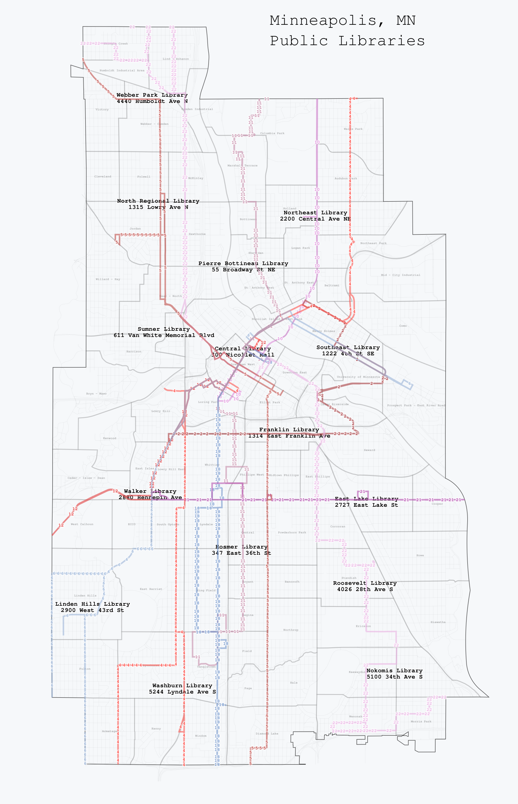

+++
title = "Custom map making with tilemill"
description = "Custom map making"
author = "Boyd Johnson"
date = 2019-09-11

[taxonomies]
tags = ["Tilemill", "GIS"]
+++

In my previous blog post, the map was made using R. I have now been exploring [Tilemill](https://github.com/tilemill-project/tilemill). I have made around 5 maps and have two maps to share here.

The first map is a map of Minneapolis, MN libraries and their relationship with bus lines. The map is designed to be useful to those who would like to explore libraries that they are not familiar with and would like to use the buslines.

<figure class="image">

 

<ficaption>Minneapolis Public Libraries Map</figcaption>
</figure>

The second map is a map of the United States and Territories in 1870 featuring the locations of railroad lines.

<figure class="image">

<figcaption>Railroads in 1870 - US</figcaption>
</figure>