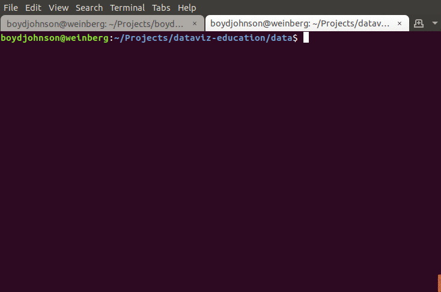
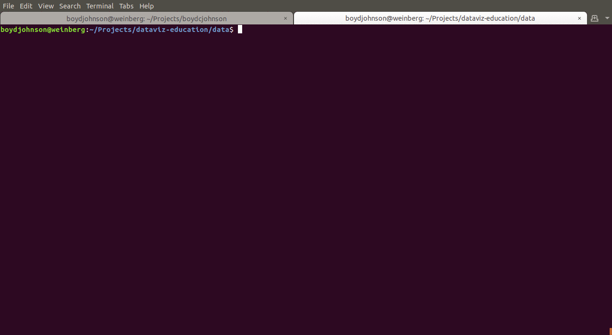
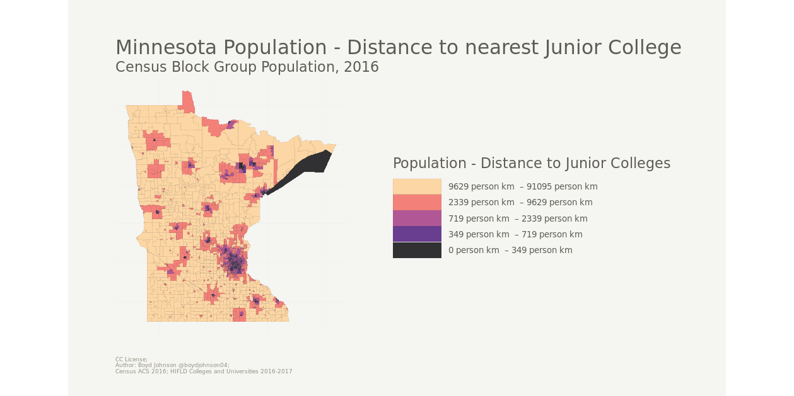

+++
title = "Improving my GIS data science workflow by building tools"
description = "Thematic Map, cli tools, GIS"
author = "Boyd Johnson"
date = 2019-05-03

[taxonomies]
tags = ["cli tools", "Rust", "GIS"]
+++

I set myself to a project of exploring some data sets and to quickly make a choropleth that shows that exploration. When I do that I usually use command line tools like [ogrinfo](https://github.com/dwtkns/gdal-cheat-sheet). The project goals were to identify areas where I couldn't find a command line tool to use, and make that tool. I am exploring Minnesota Block Group level Census data in combination with location of educational institutions.

First up, queries that I know how to do:

### non-spatial summary statistics on a single table

#### Min, Max, Avg 2016 Population Estimate for each Block Group in Minnesota

<figure class="image">

</figure>

I wondered about population in combination with the distance to the nearest educational institution. I chose Junior Colleges from my data set to be specific. This is where I am missing a tool that I can quickly leverage to make a spatial join, so I worked on building it. Enter `ndjson-spatial`:

### spatial metrics on two tables

#### Distance to nearest Junior College from centroid of Block Group, Minnesota

<figure class="image">

</figure>

### Thematic Map showing distance to nearest Junior College multiplied by population estimate

<figure class="image">

</figure>