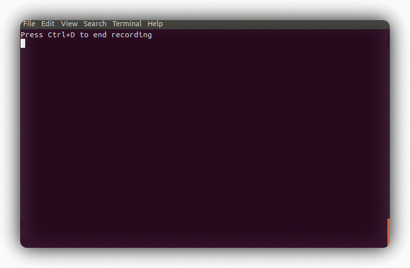
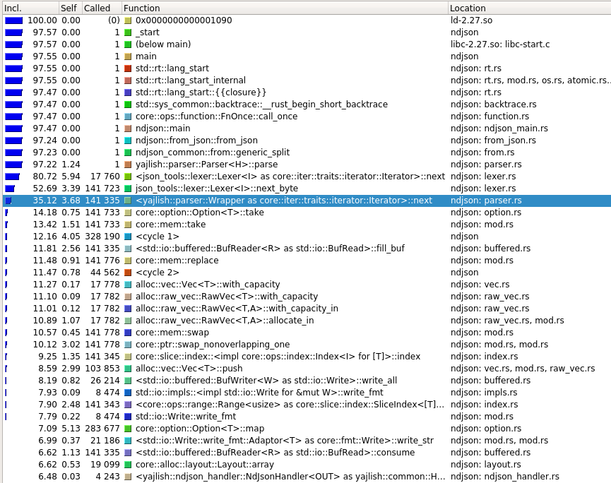
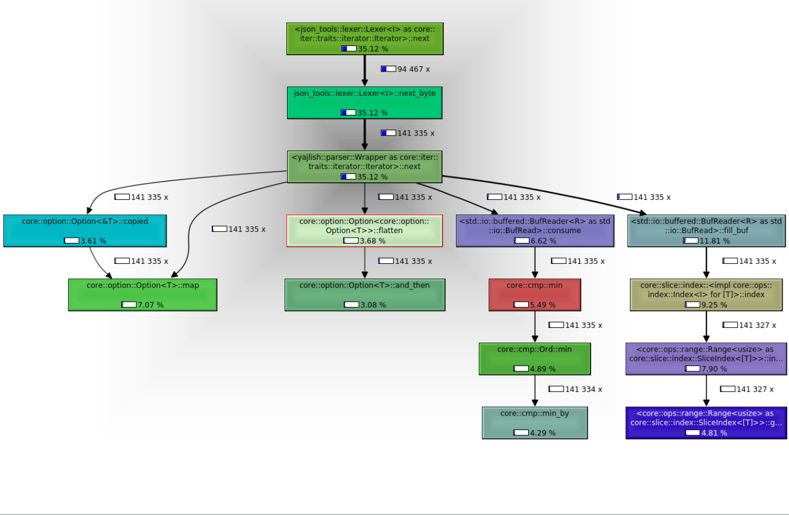
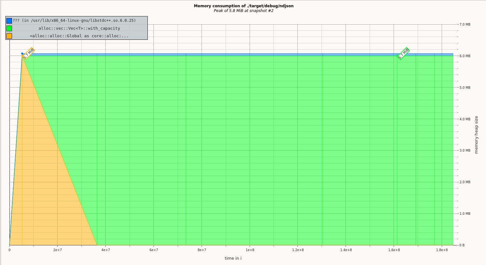

+++
title = "Tools to profile Rust CLI applications"
description = "Examples of how to use strace to profile system calls, valgrind to profile memory usage, valgrind to profile application function calls, and hyperfine to profile running time of a Rust CLI tool"
author = "Boyd Johnson"
date = 2021-01-05

[taxonomies]
tags = ["Rust", "profiling"]
+++

This blog post shows how to profile running time with Hyperfine, memory usage with Valgrind and Massif, application function calls with Valgrind and Callgrind, and system calls with strace. I will show examples of how to use these tools on a command line application written in Rust on Ubuntu Linux even though **all** of these tools work on many types of application binaries.

## Table of Contents
- **[Profiling Running Time with Hyperfine](@/blog/profile-rust-cli-applications/index.md#profiling-running-time-with-hyperfine)**
- **[Profiling Application Function Calls with Valgrind and Callgrind](@/blog/profile-rust-cli-applications/index.md#profiling-application-function-calls-with-valgrind-and-callgrind)**
- **[Profiling Memory Usage with Valgrind and Massif](@/blog/profile-rust-cli-applications/index.md#profiling-memory-usage-with-valgrind-and-massif)**
- **[Profiling System Calls with strace](@/blog/profile-rust-cli-applications/index.md#profiling-system-calls-with-strace)**

> **Info**: If you want to follow along with the examples, use the following:

To have a Rust CLI tool to profile, I'm going to use [`ndjson` the JSON/NDJSON processing tool](@/blog/tool-for-processing-large-json.md). Some of the commands need to be run on a debug build, so we should make debug and release builds.

```sh
git clone https://github.com/boydjohnson/ndjson-spatial
cd ndjson-spatial
cargo build
cargo build --release
```
To have some JSON files to use the tool on, I am using a JSON file of [current US Senators](https://www.govtrack.us/api/v2/role?current=true&role_type=senator) and the [US CFPB Complaints dataset](https://catalog.data.gov/dataset/consumer-complaint-database) on [data.gov](https://data.gov).

```sh
wget -O senators.json https://www.govtrack.us/api/v2/role?current=true\&role_type=senator
wget https://files.consumerfinance.gov/ccdb/complaints.json.zip
unzip complaints.json.zip
ls -lh complaints.json senators.json
```
complaints.json is 1.8 GiB and senators.json is 139 KiB.


# Profiling Running Time with Hyperfine

[Hyperfine](https://github.com/sharkdp/hyperfine) (from its README.md) "is a command-line benchmarking tool". I'm going to install it with `cargo`, but there are instructions for many operating systems and package managers ([hyperfine installation](https://github.com/sharkdp/hyperfine#installation)).

To install with `cargo`:

```sh
cargo install -f hyperfine
```
Hyperfine can run multiple commands at once and it will run a benchmarking session on each command.

With one command this looks like:

```sh
hyperfine --warmup 5 'cat senators.json | ./target/release/ndjson from-json d.objects >> /dev/null'
Benchmark #1: cat senators.json | ndjson from-json d.objects >> /dev/null
  Time (mean ± σ):       6.9 ms ±   1.0 ms    [User: 6.8 ms, System: 1.6 ms]
  Range (min … max):     4.4 ms …   9.0 ms    333 runs
 
  Warning: Command took less than 5 ms to complete. Results might be inaccurate.
```

Or on the larger file:

```sh
hyperfine --warmup 5 'cat complaints.json | ./target/release/ndjson from-json d >> /dev/null'
Benchmark #1: cat complaints.json | ndjson from-json d >> /dev/null
  Time (mean ± σ):     25.936 s ±  0.205 s    [User: 24.937 s, System: 1.877 s]
  Range (min … max):   25.688 s … 26.433 s    10 runs
```

What seems notable is that the system time only increased by .277 seconds. You may be wondering how many calls to the `read` [Linux system call](https://en.wikipedia.org/wiki/System_call#Categories_of_system_calls) there were. Wait until the `strace` section, as `strace` will tell us that information.

Calculating how many MB/s the `ndjson from-json` command can process can be done by 1892823525 (bytes of the complaints.json file) / 25.936 s (average from Hyperfine) / 1_000_000 = 72.89 MB/s.

Running a comparison between two commands looks like this:

> **WARNING**: the following command takes 1.5+ hours

```sh
hyperfine --warmup 5 'cat complaints.json | ./target/release/ndjson from-json d >> /dev/null' 'cat complaints.json | jq -cn --stream "fromstream(1|truncate_stream(inputs))" >> /dev/null'
Benchmark #1: cat complaints.json | ./target/release/ndjson from-json d >> /dev/null
  Time (mean ± σ):     26.013 s ±  0.172 s    [User: 25.005 s, System: 1.887 s]
  Range (min … max):   25.704 s … 26.242 s    10 runs
 
Benchmark #2: cat complaints.json | jq -cn --stream "fromstream(1|truncate_stream(inputs))" >> /dev/null
  Time (mean ± σ):     437.069 s ±  1.034 s    [User: 436.352 s, System: 13.421 s]
  Range (min … max):   435.606 s … 439.567 s    10 runs
 
Summary
  'cat complaints.json | ./target/release/ndjson from-json d >> /dev/null' ran
   16.80 ± 0.12 times faster than 'cat complaints.json | jq -cn --stream "fromstream(1|truncate_stream(inputs))" >> /dev/null'
```

<figure class="image">



</figure>

### Summary
Hyperfine can give us an average running time that is averaged over many runs so that the average is more accurate. The running time is broken down between user time and system time. Running our command on different sizes of input produced different results in user time but barely changed system time.


# Profiling Application Function Calls with Valgrind and Callgrind

[Valgrind](https://valgrind.org/) "is an instrumentation framework for building dynamic analysis tools". In my understanding, valgrind creates an environment where everything the program does goes through valgrind and can then be counted.

To install on Ubuntu:
```sh
sudo apt install valgrind
```

Valgrind can pass standard input to the command so it can be run like:

```sh
cat senators.json | valgrind ./target/release/ndjson from-json d.objects >> /dev/null
...
==19411== HEAP SUMMARY:
==19411==     in use at exit: 61 bytes in 2 blocks
==19411==   total heap usage: 19,144 allocs, 19,142 frees, 6,452,908 bytes allocated
==19411== 
==19411== LEAK SUMMARY:
==19411==    definitely lost: 0 bytes in 0 blocks
==19411==    indirectly lost: 0 bytes in 0 blocks
==19411==      possibly lost: 0 bytes in 0 blocks
==19411==    still reachable: 61 bytes in 2 blocks
==19411==         suppressed: 0 bytes in 0 blocks
==19411== Rerun with --leak-check=full to see details of leaked memory
...
```

The command had more allocs then frees, so it has a benign memory leak.

Callgrind is the tool that we will use in this section and it is installed with the valgrind package. Callgrind gives the order and timing of function calls within your program. Callgrind produces a file that can be viewed with a viewer, kcachegrind.

For the callgrind information to be understandable we need to run it on a debug build of a Rust library.

```sh
cat senators.json | valgrind --tool=callgrind ./target/debug/ndjson from-json d.objects >> /dev/null
```

This outputs a file `callgrind.out.<number>`.

To view the results with a GUI, we need to install kcachegrind.

```sh
sudo apt install kcachegrind
```

This next command will bring up a GUI.

```sh
kcachegrind callgrind.out.<number>
```

For each function call, callgrind output has the percentage of application time that is spent in that function **or** functions called by the named function, as well as percentage of time spent in that function not including called functions, and also the total number of times that function is called.

For the image below, `<yajlish::parser::Wrapper as core::iter::traits::Iterator>::next` (the highlighted function) takes 35.12% of the total time when its callees (the functions it calls) are included. The named function takes 3.68% of the time when its callees are not included. The named function is called 141,335 times.


<div class="columns">
<div class="column is-8">
<figure class="image">



</figure>
</div>
</div>

The image below is in a screen called `callgraph`. It shows the function call times, number of calls, and which function calls which. 

<div class="columns">
<div class="column">
<figure class="image">



</figure>
</div>
</div>


### Summary

Valgrind with callgrind can give information about which parts of the call graph are taking the most time and how many times functions are being called.


# Profiling Memory Usage with Valgrind and Massif

Valgrind with tool `massif` will show what memory has been allocated at different times during the running of the application.

```sh
cat senators.json | valgrind --tool=massif ./target/debug/ndjson from-json d.objects >> /dev/null
```

This produces a file called `massif.out.<number>`. To view it with a GUI we need `massif-visualizer`.

```sh
sudo apt install massif-visualizer
```

The next command opens a GUI.

```sh
massif-visualizer massif.out.<number>
```

From the GUI, the following image shows that most of the memory allocated was allocated in the function `core::alloc::Vec::with_capacity`. The heap allocation is pretty constant throughout the running time of the application.

<div class="columns">
<div class="column">
<figure class="image">



</figure>
</div>
</div>


# Profiling System Calls with strace

`strace` can show the types, number, and timing of system calls. It can even inject faults into system calls so that you can see how your application responds to an error, but I don't have examples of this usage.

Like valgrind, strace hands standard input to the command it is running.

```sh
cat senators.json | strace -c ./target/release/ndjson from-json d.objects >> /dev/null
% time     seconds  usecs/call     calls    errors syscall
------ ----------- ----------- --------- --------- ----------------
 23.25    0.000286          19        15           read
 19.19    0.000236           9        27           mmap
 16.50    0.000203          11        19           mprotect
  9.59    0.000118          12        10           openat
  6.59    0.000081           8        10        10 access
  4.55    0.000056           6        10           close
  4.47    0.000055           6        10           fstat
  4.47    0.000055          14         4           munmap
  3.33    0.000041           6         7           rt_sigaction
  1.54    0.000019           6         3           brk
  0.89    0.000011           4         3           sigaltstack
  0.89    0.000011           6         2           futex
  0.89    0.000011           6         2           prlimit64
  0.65    0.000008           8         1           execve
  0.57    0.000007           7         1           getrandom
  0.49    0.000006           6         1           write
  0.49    0.000006           6         1           sched_getaffinity
  0.41    0.000005           5         1           rt_sigprocmask
  0.41    0.000005           5         1           arch_prctl
  0.41    0.000005           5         1           set_tid_address
  0.41    0.000005           5         1           set_robust_list
------ ----------- ----------- --------- --------- ----------------
100.00    0.001230                   130        10 total
```

The `-c` flag says we want the count.

### Summary

`strace` can give the count and timing of each syscall.
